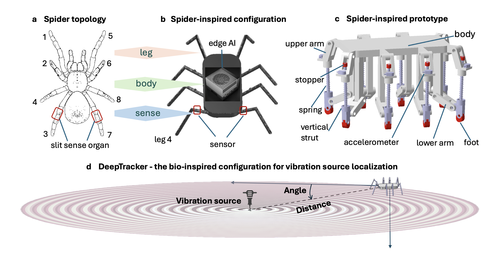

# DeepTracker

This repo implements DeepTracker v1, a novel bio-inspired device for vibration source localization. Integrating a spider-like sensor geometry with deep learning architectures, DeepTracker processes raw time-series data from eight onboard sensors to predict the exact location of a vibration source. Notably, the algorithm is substrate-agnostic, requiring no prior knowledge of the physical properties of the medium. Designed for real-time applicability, the inference pipeline is highly efficient, executing in just 0.005s on an NVIDIA Jetson edge platform.

The overall architecuture of DeepTracker is 

## How to prepare the environment

Please frist install the required python packages:

`pip install -r requirements.txt`

## How to use the code

To train the model 

`python LSTM-Reg_train.py`

To evaluate the model

`python LSTM-Reg_train.py`
